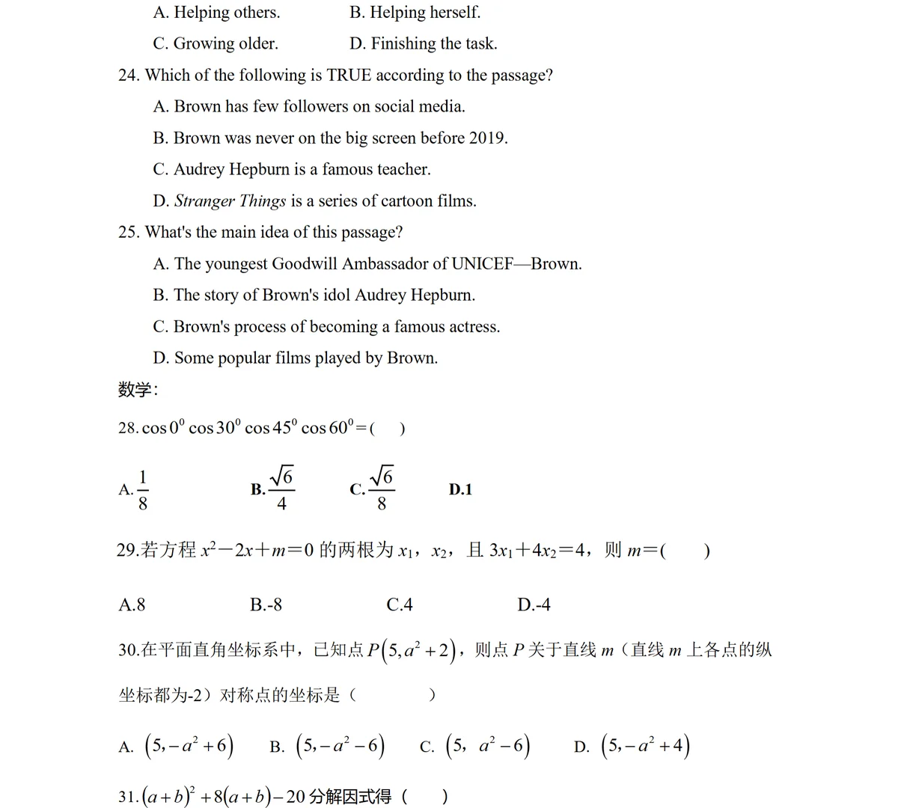
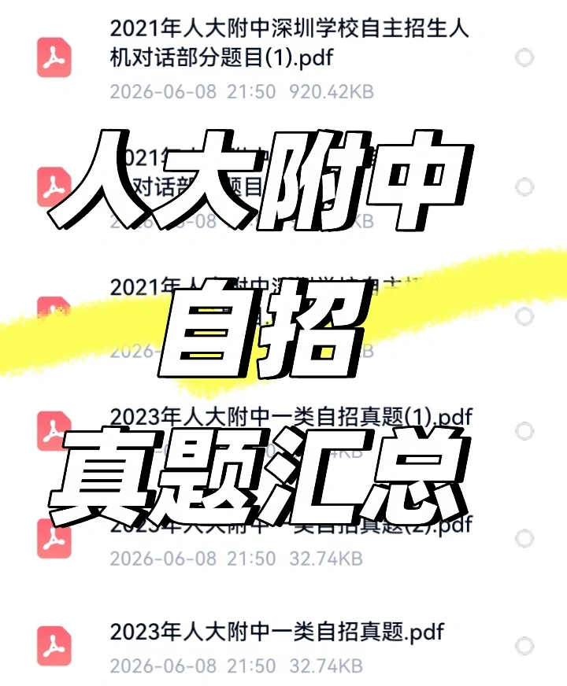

# 人大附中深圳学校自主招生 — 数学

> 🔴 考生回忆版/网络流传，仅供参考。来源：小红书"人大附中自主招生真题汇总"（6a278936，含售卖网盘）等。
> 该卖家网盘标注含：2021 人机对话部分题目、2023 一类自招真题(1)(2) 等 PDF（全卷付费，此处为公开预览页）。

## 2023 一类自招（预览页，🔴 印刷体清晰，单选）

> 原图：`images/汇总样张-01.webp`（同页另含英语阅读 24/25 题，见 ../英语）。

28. $\cos 0° \cdot \cos 30° \cdot \cos 45° \cdot \cos 60° = (\ )$
   　A. $\dfrac{1}{8}$　B. $\dfrac{\sqrt6}{4}$　C. $\dfrac{\sqrt6}{8}$　D. $1$
29. 若方程 $x^2-2x+m=0$ 的两根为 $x_1,x_2$，且 $3x_1+4x_2=4$，则 $m=(\ )$
   　A. $8$　B. $-8$　C. $4$　D. $-4$
30. 平面直角坐标系中，已知点 $P(5,\,a^2+2)$，则点 $P$ 关于直线 $m$（直线 $m$ 上各点纵坐标都为 $-2$）对称点的坐标是（ ）
   　A. $(5,\,-a^2+6)$　B. $(5,\,-a^2-6)$　C. $(5,\,a^2-6)$　D. $(5,\,-a^2+4)$
31. $(a+b)^2+8(a+b)-20$ 分解因式得（ ）

> ⚠️ 仅预览到第 28–31 题；完整卷在卖家付费网盘，未获取。题号从 28 起，说明前段为语文/英语。

## 原始资料（图）

## 考核形式（🟡）
- 人大附中深圳：无领导小组面试 + 人机对话；科目含 数学、物理、语文、英语、历史。
