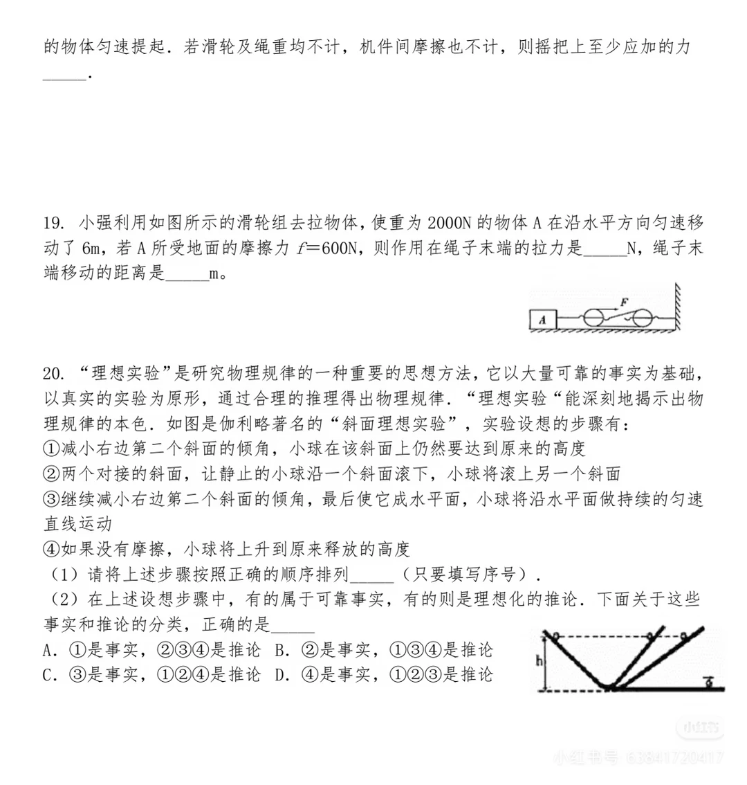
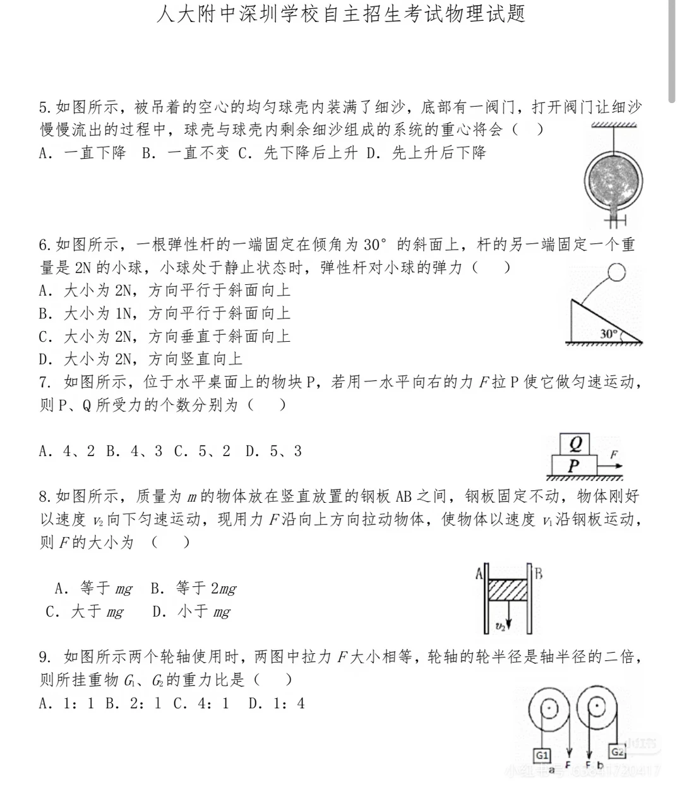
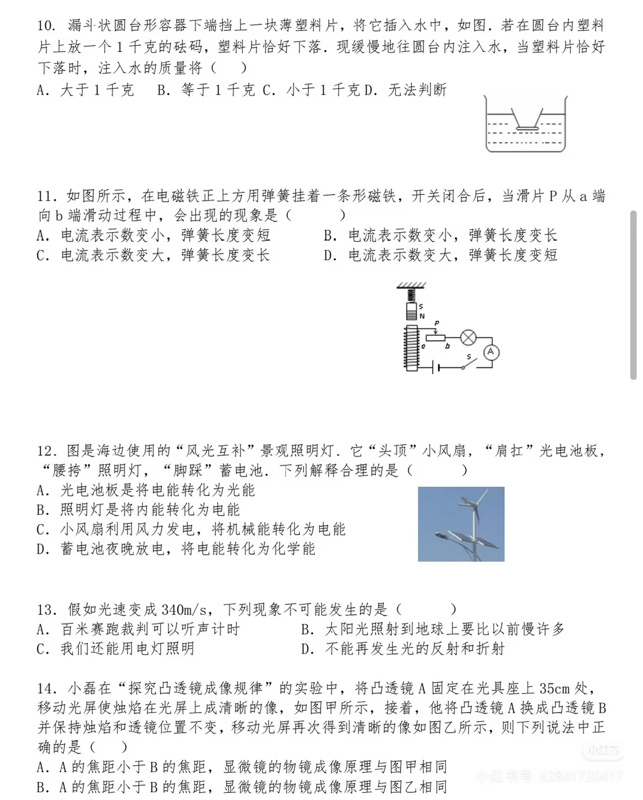
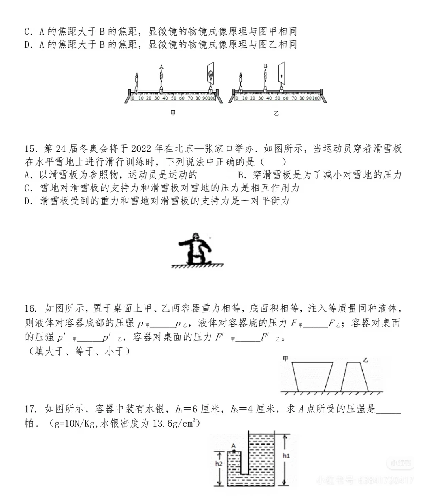

# 人大附中深圳学校自主招生 — 物理

> 🔴 考生回忆版/网络流传，仅供了解题型。来源：小红书"人大附自招物理真题"（6a0458dd）。
> 标题为"人大附中深圳学校自主招生考试物理试题"，**印刷体清晰**，多为单选，含中考拔高/竞赛风格。
> 📷 原图 4 张已存档：`images/物理-01.webp` ~ `images/物理-04.webp`。

---

## 考核形式（🟡）

- 人大附中深圳：**无领导小组面试 + 人机对话**；科目含 数学、物理、语文、英语、历史。

---

## 真题（🔴 回忆版转录，题号沿用原卷）

**Q5（重心）** 空心均匀球壳内装满细沙，底部阀门放沙。流出过程中"球壳 + 剩余细沙"系统的重心如何变化？
　A. 一直下降　B. 一直不变　C. 先下降后上升　D. 先上升后下降

**Q6（弹力）** 弹性杆一端固定在倾角 30° 的斜面上，另一端固定重 2N 的小球，静止时杆对小球的弹力为？
　A. 2N，平行斜面向上　B. 1N，平行斜面向上　C. 2N，垂直斜面向上　D. 2N，竖直向上

**Q7（受力个数）** 水平桌面上有物块 P，用水平向右的力 F 拉 P 使其匀速运动，P、Q 各受力个数为？
　A. 4、2　B. 4、3　C. 5、2　D. 5、3

**Q8（摩擦/平衡）** 质量 m 的物块夹在竖直钢板 AB 之间，原以速度 v₁ 匀速下滑；用力 F 向上拉使其以 v₂ 沿钢板运动，则 F 大小为？
　A. 等于 mg　B. 等于 2mg　C. 大于 mg　D. 小于 mg

**Q9（轮轴）** 两轮轴所受拉力 F 相等，轮半径 = 轴半径的 2 倍，所挂重物 G₁ : G₂ 之比为？
　A. 1 : 1　B. 2 : 1　C. 4 : 1　D. 1 : 4

**Q19（滑轮组，填空）** 用滑轮组拉重 2000N 的物体 A 沿水平方向匀速移动 6m，A 受地面摩擦力 f = 600N，则绳端拉力 ＿ N、绳端移动距离 ＿ m。

**Q20（伽利略斜面理想实验）** 给出 4 个步骤 ①~④：
1. 按正确顺序排列序号；
2. 区分其中的"事实"与"推论"（四选一）。

> ⚠️ 还有约 2 张图（电学等）未转录，见原帖原图。

---

## 原始资料（图）

---

## 待补

- 🔴 电学等未转录题（结合原图补全）。
- 🟢 历年官方自招简章（人大附中深圳官网）。

---

*资料来源：小红书 6a0458dd（人大附自招物理真题，回忆版），印刷体清晰*
