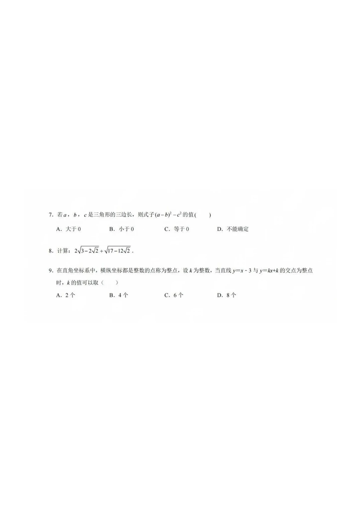
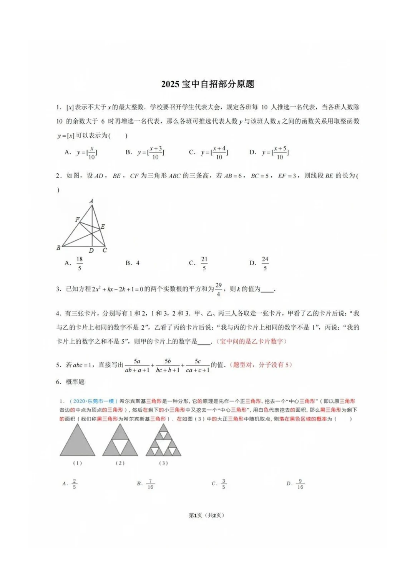

# 宝安中学（集团）自主招生 — 数学

> 🔴 考生回忆版，仅供参考。来源：小红书"2025年宝安中学部分【数学】自招真题回忆版"（698aff7f）。印刷体清晰。
> 原图：`images/2025数学回忆-01.webp`、`images/2025数学回忆-02.webp`

## 2025 宝中自招部分原题

1. $[x]$ 表示不大于 $x$ 的最大整数。学校召开学生代表大会，规定各班每 10 人推选 1 名代表，当各班人数除以 10 的余数大于 6 时再增选 1 名代表。则各班可推选代表人数 $y$ 与班级人数 $x$ 的函数关系（用取整函数 $y=[\,\cdot\,]$）可表示为（ ）
   　A. $y=[\frac{x}{10}]$　B. $y=[\frac{x+3}{10}]$　C. $y=[\frac{x+4}{10}]$　D. $y=[\frac{x+5}{10}]$
2. 如图，设 $AD,BE,CF$ 为 $\triangle ABC$ 的三条高，若 $AB=6,\ BC=5,\ EF=3$，则线段 $BE$ 的长为（ ）
   　A. $\frac{18}{5}$　B. $4$　C. $\frac{21}{5}$　D. $\frac{24}{5}$
3. 已知方程 $2x^2+kx-2k+1=0$ 的两个实数根的平方和为 $\frac{29}{4}$，则 $k$ 的值为＿。
4. 有三张卡片分别写有 1和2、1和3、2和3。甲乙丙各取一张：甲看乙后说"我与乙相同的数字不是 2"，乙看丙后说"我与丙相同的数字不是 1"，丙说"我的卡片数字之和不是 5"。则乙卡片上的数字是＿。
5. 若 $abc=1$，直接写出 $\dfrac{a}{ab+a+1}+\dfrac{b}{bc+b+1}+\dfrac{c}{ca+c+1}$ 的值。（原帖注：题型对，分子无 5）
6. 概率题（2020 东莞一模·希尔宾斯基三角形分形）：在大正三角形中随机取点，落在黑色区域的概率为（ ）
   　A. $\frac{2}{5}$　B. $\frac{7}{16}$　C. $\frac{3}{5}$　D. $\frac{9}{16}$

> 共 2 页，第 2 页未获取。

