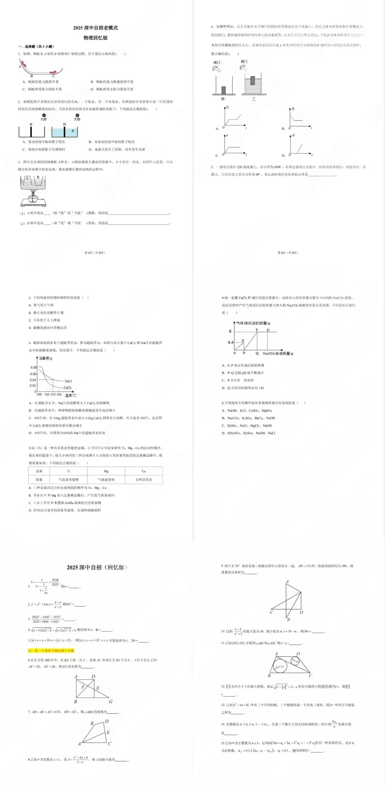

# 深圳中学自主招生 — 化学

> 以下内容综合 2023-2025 年考生回忆版，仅供参考。

---

## ⭐ 2025 老模式合卷·化学（回忆版原卷，🔴 印刷体清晰）

> 原图：`images/2025-老模式合卷.webp`（物理+化学+数学同卷）。来源：小红书"2025深中自招【物理+数学】真题"（686ce458）。

1. 下列用途利用物质**物理性质**的是（ ）
   A.氧气用于气焊　B.熟石灰改良酸性土壤　C.干冰用于人工降雨　D.碳酸氢钠治疗胃酸过多
2. 地球深处的水处于超临界状态（超临界水）。如图为某压强下 CaCl₂ 和 NaCl 在超临界水中的溶解度曲线，该压强下下列说法正确的是（ ）
   A.超临界水中 NaCl 溶解度大于 CaCl₂　B.两种物质溶解度都随温度升高而增大　C.450℃时 100g 超临界水加 0.02g CaCl₂ 充分溶解，再升温至 500℃，CaCl₂ 溶液溶质质量分数减小　D.450℃时可得 0.04% 的 NaCl 超临界水溶液
3. 钛(Ti)研究 Ti、Mg、Cu 活动性：等大薄片放入等质量等浓度足量稀盐酸，现象 Ti 气泡缓慢/Mg 气泡快/Cu 无明显现象。下列正确的是（ ）
   A.活动性由强到弱 Ti、Mg、Cu　B.等量 Ti 和 Mg 加过量稀盐酸产生氢气质量相同　C.工业上常用 Ti 置换 CuSO₄ 制铜　D.影响反应速率的因素有温度、压强和接触面积
4. 向一定量 CaCl₂ 和 HCl 混合溶液中逐渐加入 10.6% 的 Na₂CO₃ 溶液，产生气体或沉淀质量与所加 Na₂CO₃ 溶液质量关系如图（纵轴标 8 与 4.4，横轴有 P、Q 点）。下列正确的是（ ）
   A.0~P 表示生成沉淀的质量　B.P~Q 过程 pH 不断增大　C.P 点只有一种溶质　D.Q 点对应横坐标为 180
5. 下列各组不用额外添加其他物质就可鉴别的是（ ）
   A.NaOH、KCl、CuSO₄、MgSO₄　B.Na₂CO₃、K₂SO₄、BaCl₂、NaOH　C.H₂SO₄、NaCl、MgCl₂、NaOH　D.NH₄NO₃、H₂SO₄、NaOH、NaCl

---

## 一、考试概况

| 项目 | 说明 |
|------|------|
| 考试形式 | 与数学、物理合卷机考 |
| 题量 | 5 道题 |
| 分值 | 每题 2 分，共 10 分 |
| 题型 | 选择题/填空题 |
| 难度 | 中等偏上，以初中化学为主 |

---

## 二、高频考点分布

| 模块 | 具体考点 | 出现频率 |
|------|----------|----------|
| 物质的性质与变化 | 物理变化与化学变化的判断 | ★★★★ |
| 化学方程式 | 书写、配平、反应类型判断 | ★★★★ |
| 金属与酸碱盐 | 金属活动性顺序、置换反应 | ★★★★★ |
| 溶液与溶解度 | 溶解度曲线、饱和/不饱和溶液 | ★★★ |
| 实验探究 | 气体制备、物质鉴别、实验方案设计 | ★★★★ |

---

## 三、真题精选（考生回忆版）

**题目 1**：下列变化中，属于化学变化的是（ ）
A. 冰雪融化  B. 铁锅生锈  C. 汽油挥发  D. 石蜡熔化

---

**题目 2**：某金属 X 放入硫酸铜溶液中，表面有红色物质析出。将 X 放入稀盐酸中，有气泡产生。则金属 X 的活动性排列正确的是（ ）
A. X > H > Cu  B. Cu > X > H  C. X > Cu > H  D. H > X > Cu

---

**题目 3**：实验室用过氧化氢和二氧化锰制取氧气，下列说法正确的是（ ）
A. 二氧化锰是反应物
B. 该反应属于分解反应
C. 反应后二氧化锰质量减少
D. 可用排水法或向上排空气法收集氧气

---

**题目 4**：下图为 A、B、C 三种固体物质的溶解度曲线。下列说法错误的是（ ）
A. t₂℃时，A 的溶解度大于 B 的溶解度
B. t₁℃时，B 和 C 的溶解度相等
C. 将 t₂℃时 A 的饱和溶液降温到 t₁℃，溶质质量分数不变
D. A 的溶解度随温度升高而增大

---

**题目 5**：某化学兴趣小组需要鉴别以下四种白色固体粉末：NaCl、Na₂CO₃、CaCO₃、NaOH。仅用一种试剂即可鉴别，该试剂是（ ）

---

## 四、备考建议

1. 深中化学题量虽少（仅 5 题），但要求准确率高，需打牢基础
2. 重点复习**金属活动性顺序**和**酸碱盐之间的反应**
3. **物质鉴别与推断**是常考题型，需掌握各物质的特征反应和现象
4. 化学方程式的书写和配平必须熟练
5. 关注化学与生活的联系（如食品安全、环境保护相关题目）

---

*资料来源：考生回忆版，综合深圳中考网、科翰教育等平台*
